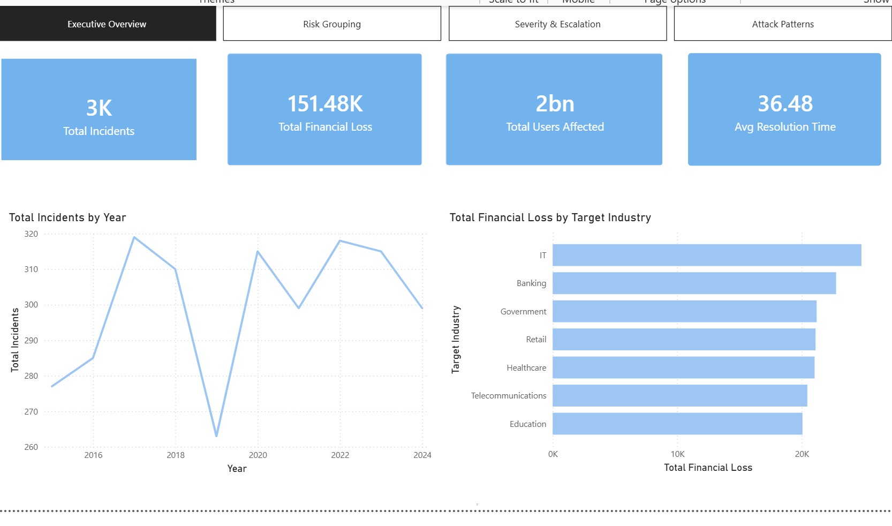
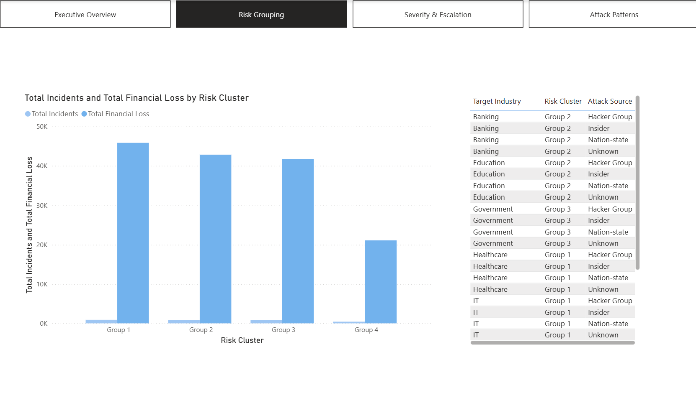
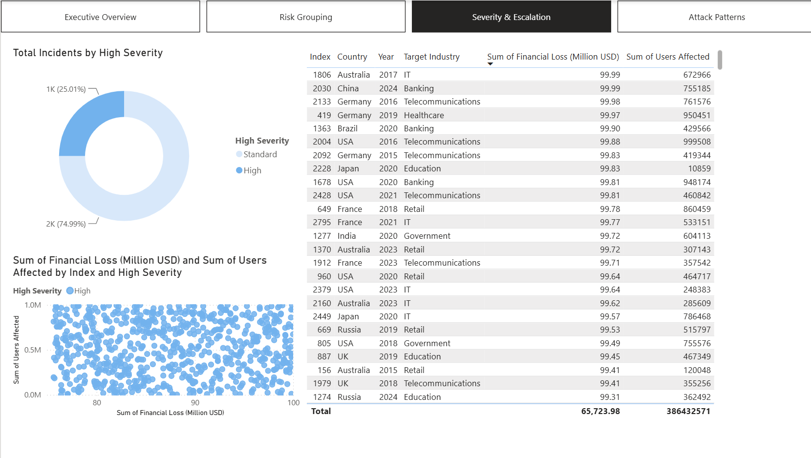
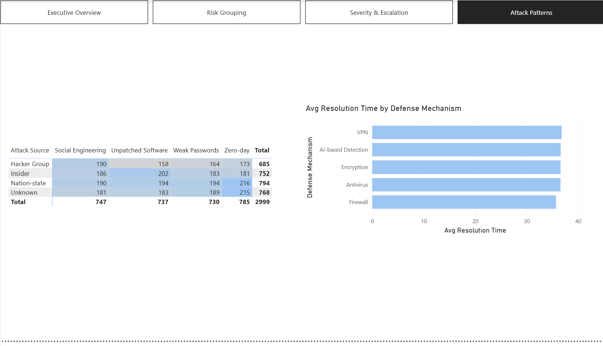

# Cybersecurity Threat & Risk Analytics

**Business question:** Which industries share similar cyberattack risk profiles, how is incident volume trending, and which incidents should get flagged for priority review?

This project takes a raw, incident-level cybersecurity dataset (industry, attack source, financial loss, users affected, resolution time) and turns it into three things a security or risk team could actually use:

1. **A risk-grouping model** — clusters industries by attack pattern similarity, so a team can ask "who else looks like us?" and borrow defense strategies from peers.
2. **A short-term forecast** — projects incident volume forward to support planning and staffing conversations.
3. **An anomaly flag** — surfaces the ~5% of incidents worth escalating first, based on severity and impact.

## Approach

| Step | What it does | File |
|---|---|---|
| 1. Clean & prepare | Load the raw incident data, standardize types, handle missing values | `src/01_data_prep.py` |
| 2. Cluster industries | PCA + KMeans on attack-pattern features to group industries by risk profile | `src/02_cluster_industries.py` |
| 3. Forecast incident volume | Simple Exponential Smoothing on yearly incident counts, 3-year projection | `src/03_forecast_incidents.py` |
| 4. Flag anomalies | Isolation Forest to catch high-loss / high-impact incidents early | `src/04_anomaly_detection.py` |
| 5. Compare severity models | Logistic Regression vs. Random Forest vs. Gradient Boosting for predicting high-severity loss | `src/05_severity_model_comparison.py` |
| 6. Correlation check | Attack-source correlation matrix + financial-loss vs. users-affected relationship | `src/06_correlation_analysis.py` |

## Key findings

*(Run against the actual [Global Cybersecurity Threats 2015–2024](https://www.kaggle.com/datasets/atharvasoundankar/global-cybersecurity-threats-2015-2024) dataset, 3,000 incidents.)*

- Industries cluster into four groups by attack-pattern similarity. **Healthcare and IT share a cluster**, and **Government and Telecommunications share another** — a starting point for cross-referencing defense strategies between industries with similar exposure.
- Incident volume forecasting (SES) projects a flat ~300 incidents/year over the next 3 years, reflecting recent volatility settling around that average. This model is intentionally simple and doesn't capture seasonality or sudden shifts — a limitation worth stating rather than hiding.
- Anomaly detection flagged **150 of 3,000 incidents (5%)**, and the top flagged cases by financial loss cluster in the $99M+ range — the model is correctly surfacing the highest-impact incidents, not just noise.
- **Financial loss and number of affected users show effectively no correlation** (Pearson r = 0.0018) — a small-dollar incident can affect as many people as a large one. This matters operationally: severity should be tracked as two independent signals, not one combined score.
- Attempted to predict "high financial loss" incidents from industry, attack source, and country using Logistic Regression, Random Forest, and Gradient Boosting. **None of the three models meaningfully beat guessing the majority class** (best F1 on the high-severity class: 0.15). This is a genuine, useful finding rather than a modeling failure to paper over: it means financial loss in this dataset isn't predictable from the categorical incident metadata alone, and any real prioritization system would need richer features (attack duration, prior incident history, etc.) than what's captured here.

## Power BI report

The same analysis, rebuilt as an interactive 4-page Power BI report for a business audience — same underlying findings, translated into KPI cards, drill-down tables, and cross-filterable charts instead of static plots.

**Page 1 — Executive Overview:** total incidents, financial loss, users affected, and average resolution time at a glance, plus incident volume by year and loss by industry.



**Page 2 — Risk Grouping:** the clustering result made business-readable — which industries share a risk profile, and which attack sources they're exposed to.



**Page 3 — Severity & Escalation:** the high-severity split, a scatter of loss vs. users affected (visually confirming the near-zero correlation found in the Python analysis), and a sortable table of the highest-loss incidents to escalate first.



**Page 4 — Attack Patterns:** a heatmap-style matrix of attack source vs. defense mechanism, plus average resolution time by defense mechanism used.



Build instructions and DAX measures are in [`POWERBI_GUIDE.md`](POWERBI_GUIDE.md) if you want to reproduce it from the prepared CSVs in `data/`.


## Data

This project runs on the [Global Cybersecurity Threats (2015–2024)](https://www.kaggle.com/datasets/atharvasoundankar/global-cybersecurity-threats-2015-2024) dataset. Place the CSV in `data/` and update the path in `src/01_data_prep.py`.

## Running it

```bash
pip install -r requirements.txt
python src/01_data_prep.py
python src/02_cluster_industries.py
python src/03_forecast_incidents.py
python src/04_anomaly_detection.py
python src/05_severity_model_comparison.py
python src/06_correlation_analysis.py
```
